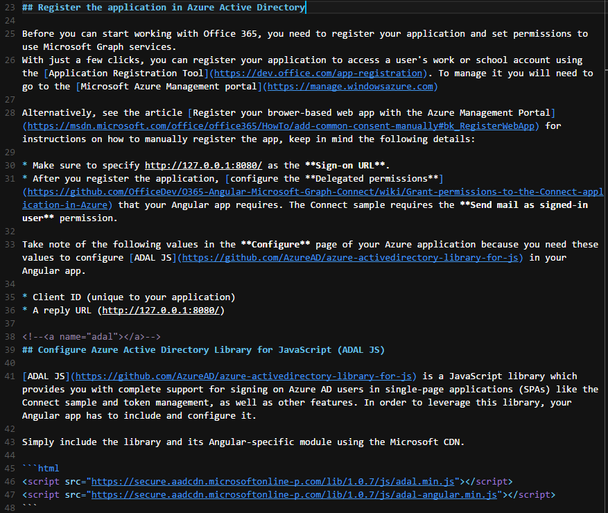

# Microsoft Graph VS Code theme
This is a VS Code theme based on the [Microsoft Graph website](http://graph.microsoft.io). Heavy with blues and purples, this theme is great for editing Markdown or code.

The development of this theme was inspired by all of the hard work done by the Graph team leading up to the start of the Connect(); 2015 conference.

## Install
1. In Visual Studio Code, click `View` => `Command Palette...`.
2. Choose `Extensions: Install Extension`.
3. Search for `Microsoft Graph Theme` and click the download button at the bottom right.

## Questions, issues, or suggestions
For any questions, issues, or suggestions, please open an issue in this project's [GitHub repository](https://github.com/martellaj/microsoft-graph-theme/issues).
